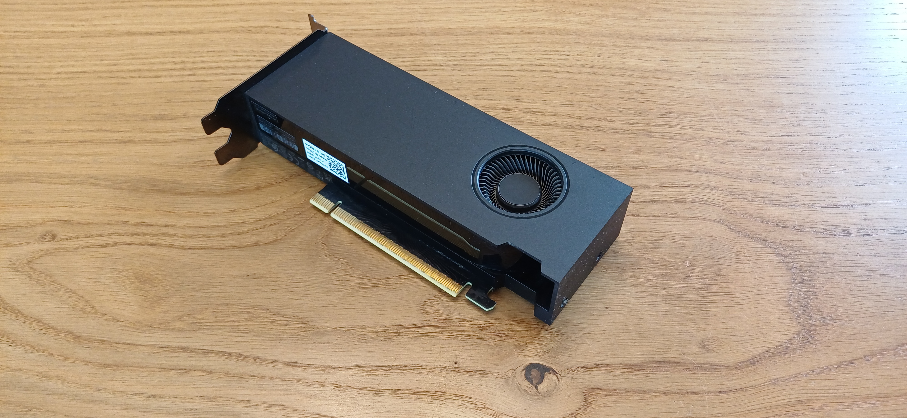

# Llama.cpp Server with Docker with 6GB VRAM



Docker-based deployment of an OpenAI-compatible LLM API server powered by [llama.cpp](https://github.com/ggml-org/llama.cpp) with CUDA and MTP speculative decoding, optimized for **NVIDIA GPUs with 6 GB VRAM** (RTX A2000).

Three production models run in parallel on separate RTX A2000 machines, serving ~27–33 tok/s each — fully private, fully local.

---

## Table of Contents

- [Features](#features)
- [Technologies](#technologies)
- [Architecture](#architecture)
- [Quick Start](#quick-start)
- [Configuration](#configuration)
- [Operations](#operations)
- [Project Structure](#project-structure)
- [CI/CD](#cicd)
- [Performance](#performance)
- [Troubleshooting](#troubleshooting)
- [Known Issues — TODO](#known-issues--todo)
- [License](#license)

---

## Features

- OpenAI-compatible chat completions API (`/v1/chat/completions`)
- MTP (Multi-Token Prediction) speculative decoding for ~10–15% throughput gain
- Multiple model support: Qwen3.6 35B (Q4/Q5), Gemma 4 26B
- Flash Attention, q8_0 KV cache, context up to 160K tokens
- Prompt cache in system RAM (`--cache-ram`)
- Dynamic model switching via router (experimental)
- GPU watchdog with self-heal (CPU fallback detection)
- One-command provisioning (`install-llama.sh`)
- CI/CD: GitHub Actions → GitHub Container Registry

## Technologies

| Component | Detail |
|---|---|
| **Runtime** | [llama.cpp](https://github.com/ggml-org/llama.cpp) `master` |
| **Server** | `llama-server` with CUDA, curl, OpenSSL |
| **GPU API** | CUDA 12.4 |
| **Container** | Docker + docker-compose |
| **GPU in Docker** | `nvidia-container-toolkit` |
| **Registry** | GitHub Container Registry (`ghcr.io/noxgle/llama-server`) |
| **Models** | HuggingFace GGUF (Qwen3.6, Gemma 4 via Unsloth) |
| **Quantization** | Q4\_K\_M, Q5\_K\_M, Q8\_K\_XL |

## Architecture

```
Proxmox Host (192.168.200.7)
├── Dev LXC (38) — compilation, benchmarking
├── Prod Qwen (20) — Qwen3.6 Q4_K_M (~33 tok/s)
├── Prod Gemma4 (21) — Gemma4 26B (~27 tok/s)
└── Prod Q5 (19) — Qwen3.6 Q5_K_M (~30 tok/s)
```

Each LXC runs a Docker container with:
- `restart: unless-stopped` — auto-recovery
- GPU via `deploy.resources.reservations.devices` (not `--gpus all`)
- HuggingFace cache volume for model weights
- `llama-gpu-watchdog.timer` (systemd) — detects CPU fallback, self-heals

Host pre-requisites: NVIDIA drivers, GPU passthrough (for Proxmox LXC), kernel modules auto-load.

> **Full provisioning details:** [`deploy/install-llama.sh`](deploy/install-llama.sh) (single-command install) or [`bootstrap/fresh-proxmox/`](bootstrap/fresh-proxmox/) (Proxmox → LXC → Docker bootstrap).

---

## Quick Start

### New machine (Debian 12+ / Ubuntu 22.04+)

```bash
# Qwen3.6 (production default, ~33 tok/s)
bash <(curl -fsSL https://raw.githubusercontent.com/noxgle/llama/master/deploy/install-llama.sh) qwen

# Gemma4 26B (alternative, ~27 tok/s)
bash <(curl -fsSL https://raw.githubusercontent.com/noxgle/llama/master/deploy/install-llama.sh) gemma4

# Qwen3.6 Q5_K_M (higher quality, ~30 tok/s, needs ≥35 GB free)
bash <(curl -fsSL https://raw.githubusercontent.com/noxgle/llama/master/deploy/install-llama.sh) qwen-q5
```

The script installs Docker, `nvidia-container-toolkit`, pulls the server image, downloads model weights, and starts the server on **port 8089** with `restart: unless-stopped`.

> **Minimum disk:** 70 GB (80 GB for Q5 variant). For Proxmox LXC: GPU passthrough required on host.

### Verify

```bash
curl http://<server-ip>:8089/health
curl http://<server-ip>:8089/v1/chat/completions \
  -H "Content-Type: application/json" \
  -d '{"messages":[{"role":"user","content":"Hello!"}],"model":"qwen3.6","max_tokens":200}' | jq .
```

---

## Configuration

### Model profiles

| Profile | Config file | Model source | Speed | VRAM |
|---|---|---|---|---:|
| **Qwen3.6 Q4\_K\_M** (default) | `configs/qwen3.6-35ba3b-mtp-unsloth.env` | `-hf unsloth/...:UD-Q4_K_M` | ~33 tok/s | ~5.2 GiB |
| **Qwen3.6 Q5\_K\_M** | `configs/qwen3.6-35ba3b-mtp-unsloth-q5.env` | Local GGUF (symlink) | ~30 tok/s | ~5.3 GiB |
| **Gemma4 26B Q4\_K\_M + MTP** | `configs/gemma4-26b-q4-k-m-mtp.env` | Local GGUF (symlink) + draft head | ~27 tok/s | ~5.4 GiB |
| **Gemma4 Q8\_K\_XL** (deprecated) | `configs/gemma4-26b-q8_0-mtp.env` | Local GGUF (symlink) + draft head | ~11 tok/s | ~4.0 GiB |

### Switching models

```bash
# On server, copy the desired config and restart
cp configs/qwen3.6-35ba3b-mtp-unsloth-q5.env .env
docker compose down && docker compose up -d
```

Or use `llama.sh` (see [Operations](#operations)).

### Post-Install: Gemma4 manual steps

The `install-llama.sh gemma4` script pre-caches the main model but needs two manual steps:

**1. Download the MTP draft head:**
```bash
curl -L -o /opt/llama/models/gemma4-26b-q8-mtp.gguf \
  https://huggingface.co/unsloth/gemma-4-26B-A4B-it-GGUF/resolve/main/MTP/gemma-4-26B-A4B-it-Q8_0-MTP.gguf
```

**2. Create symlinks (container paths only!):**
```bash
MAIN_HASH=$(find /var/lib/docker/volumes/llama_hf-cache/_data/hub/ \
  -name "*UD-Q4_K_M*" -type f -exec basename {} \; | head -1)
ln -sf \
  "/root/.cache/huggingface/hub/models--unsloth--gemma-4-26B-A4B-it-GGUF/blobs/$MAIN_HASH" \
  /opt/llama/models/gemma4-26b-q4-k-m.gguf
```

Verify:
```bash
docker run --rm -v /opt/llama/models:/models -v llama_hf-cache:/root/.cache/huggingface \
  --entrypoint bash ghcr.io/noxgle/llama-server:latest \
  -c "head -c 4 /models/gemma4-26b-q4-k-m.gguf | od -A x -t x1z"
# Expected: 000000 47 47 55 46  >GGUF<
```

### Key environment variables

| Variable | Description | Qwen3.6 (default) |
|---|---|---|
| `MODEL` / `MODEL_FLAG` | Model source (`-hf` repo or `-m` local path) | `unsloth/Qwen3.6-35B-A3B-MTP-GGUF:UD-Q4_K_M` |
| `CTX` | Context length | `143360` (140K) |
| `NGLAYERS` | GPU layers (999 = all) | `999` |
| `BATCH` / `UBATCH` | Batch sizes | `3072` / `1536` |
| `CACHE_TYPE_K` / `CACHE_TYPE_V` | KV cache precision | `q8_0` / `q8_0` |
| `CACHE_RAM` | Prompt cache in system RAM (MB) | `4096` |
| `SPEC_TYPE` | Speculative decoding mode | `draft-mtp` |
| `SPEC_DRAFT_N_MAX` | MTP draft tokens per step | `1` |
| `CPUMOE` | MoE expert placement | `exps=CPU` |
| `THREADS` / `THREADS_BATCH` | CPU threads (match LXC vCPU count) | `4` / `4` |

> **Important:** `.env` changes require `docker compose down && docker compose up -d` — `restart` does **not** re-read `.env`. The `.env` file is in `.gitignore` and excluded from `sync.sh push`. To apply config changes on a server: `cp configs/<name>.env .env && docker compose down && docker compose up -d`.

### Router mode (experimental)

Start with `llama.sh start router`. Switch models dynamically via API — no restart:

```bash
curl -X POST http://localhost:8089/models/load \
  -H "Content-Type: application/json" \
  -d '{"model": "qwen-q4"}'
```

Models defined in [`configs/router-preset.ini`](configs/router-preset.ini). Router spawns child processes per model, proxies requests, and uses LRU unloading. **Maximum 2 models on 6 GB VRAM** — VRAM leak between swaps requires `docker restart llama-router`.

> **Limitations:** VRAM leak on model switch, no auto-restart of child processes, single point of failure. Recommended only for dev/benchmarking on 6 GB. Best for GPUs with ≥24 GB VRAM.

---

## Operations

### `llama.sh` — model control script

Manage models via `docker run` (testing/development):

```bash
/opt/llama/llama.sh start qwen       # Start Qwen3.6 (port 8089)
/opt/llama/llama.sh start gemma4     # Switch to Gemma4 (stops previous)
/opt/llama/llama.sh status           # List running containers
/opt/llama/llama.sh stop             # Stop all llama containers
/opt/llama/llama.sh logs qwen        # Tail logs
/opt/llama/llama.sh pull             # Pull latest image from GHCR
```

> **Note:** `llama.sh` uses `--gpus all` which may cause degraded performance after reboot on Docker 26.1.5 (see [Troubleshooting](#troubleshooting)). For production, use `docker-compose.yml`.

### `sync.sh` — local ↔ server sync

```bash
./sync.sh push          # Local → server (excludes .env, .git/)
./sync.sh deploy        # Push + docker compose down && up
./sync.sh health        # HTTP 200 + VRAM + RAM
./sync.sh status        # Container + GPU processes
./sync.sh logs          # Tail remote logs
./sync.sh ssh           # Open SSH session
./sync.sh config        # Show remote .env
```

Target server: `root@192.168.200.38:/opt/llama`.

### API Endpoints

| Endpoint | Method | Description |
|---|---|---|
| `/health` | GET | Server health check |
| `/v1/chat/completions` | POST | OpenAI-compatible chat |
| `/models/load` | POST | Switch model (router mode only) |

```bash
# Quick throughput probe
curl -s http://localhost:8089/v1/chat/completions \
  -H "Content-Type: application/json" \
  -d '{"messages":[{"role":"user","content":"Write ~500 chars."}],"model":"qwen3.6","max_tokens":500}' \
  | jq '.timings.predicted_per_second'
```

### GPU Watchdog

Systemd timer (`llama-gpu-watchdog.timer`) checks every 2 minutes for CPU fallback (0 MiB VRAM, `ggml_cuda_init: failed`). Self-heals: restart container → if still CPU → restart Docker. Max 2 attempts, 30 min cooldown.

```bash
# Deploy on a new server
cp scripts/gpu-watchdog.sh /opt/llama/scripts/
cp deploy/systemd/llama-gpu-watchdog.{service,timer} /etc/systemd/system/
systemctl daemon-reload && systemctl enable --now llama-gpu-watchdog.timer
```

---

## Project Structure

```
├── .github/workflows/build.yml   CI/CD build workflow
├── configs/                       Model config profiles (*.env)
│   ├── qwen3.6-35ba3b-mtp-unsloth.env      (default)
│   ├── qwen3.6-35ba3b-mtp-unsloth-q5.env   (Q5 variant)
│   ├── gemma4-26b-q4-k-m-mtp.env            (Gemma4)
│   ├── gemma4-26b-q8_0-mtp.env              (deprecated)
│   ├── router-preset.ini                    (router models)
│   └── router.env                           (router main config)
├── deploy/
│   ├── install-llama.sh           Single-command provisioning
│   ├── install-llama-dev.sh        Dev variant
│   └── systemd/                   Systemd units (watchdog, service)
├── scripts/                       GPU watchdog, benchmarks
│   ├── gpu-watchdog.sh
│   ├── benchmark-batch.sh
│   ├── benchmark-knowledge.sh
│   └── benchmark-guarded-remote.sh
├── bootstrap/fresh-proxmox/       Full Proxmox LXC bootstrap
├── Dockerfile                     llama-server build
├── docker-compose.yml             Production deployment
├── docker-compose.test.yml        Test/PR deployment
├── llama.sh                       docker run wrapper
├── sync.sh                        Remote sync tool
├── server_check.sh                Quick server diagnostic
├── AGENTS.md                      Operational reference (gotchas, configs)
└── TODO.md                        Testing roadmap
```

---

## CI/CD

Build workflow: `.github/workflows/build.yml`

| Trigger | Tags |
|---|---|
| Push to `master` | `ghcr.io/noxgle/llama-server:latest`, `:sha-<commit>` |
| Tag `b*` or `stable*` | `ghcr.io/noxgle/llama-server:<tag>` |

- Source: `ggml-org/llama.cpp.git` (default `master`, pin via `LLAMA_REF`)
- Build flag: `-DGGML_CUDA_NCCL=OFF` (single GPU, no libnccl)
- Image is public — no authentication needed for pull
- Self-hosted runner (6-core): ~60–90 min build; GitHub-hosted: ~3–4 h

---

## Performance

### Current production configs (RTX A2000 6 GB, LXC 4 vCPU, 30 GB RAM)

| Config | Model | Gen speed | Prefill (45K) | VRAM | RAM |
|---|---|---|---:|---:|---:|
| Qwen3.6 Q4\_K\_M, q8\_0 KV, MTP | 22.7 GB | **~33 tok/s** | **~680 t/s** | 5.2 GiB | 20 GiB |
| Qwen3.6 Q5\_K\_M, q8\_0 KV, MTP | 26 GB | **~30 tok/s** | ~630 t/s | 5.3 GiB | 25 GiB |
| Gemma4 Q4\_K\_M + MTP draft, q4\_0 KV | ~17 GB + 462 MB | **~27 tok/s** | — | 5.4 GiB | 15 GiB |

Key findings:
- **BATCH=3072, UBATCH=1536** is optimal (Qwen3.6) — +88% prefill, −35% total time over baseline
- **UBATCH must ≈ BATCH** — 1024/256 was 39% _slower_ than baseline
- **MTP n_max=1 is optimal** — +10% vs MTP off; each extra draft token triggers CPU-side MoE overhead
- Generation speed is memory-bandwidth-bound, unaffected by batch size

> **Full benchmark data:** `scripts/benchmark-batch.sh`, `scripts/benchmark-knowledge.sh`, and `scripts/benchmark-knowledge-compare.md`.

---

## Troubleshooting

### `--gpus all` → 1.5 tok/s after reboot (Docker 26.1.5)

The `--gpus all` flag (used by `llama.sh`) does not fully initialize the GPU runtime after boot on Docker 26.1.5. **Use `docker-compose.yml`** which uses `deploy.resources.reservations.devices` — verified 31.8 tok/s immediately after reboot.

### `.env` changes ignored

`docker compose restart` does **not** re-read `.env`. Always `docker compose down && docker compose up -d`.

### HF download bug (`get_hf_plan`)

`:UD-Q4_K_M` works via HF, but `:UD-Q8_K_XL` and subdirectory files (e.g., `MTP/`) fail. Workaround: local symlinks with `MODEL_FLAG=-m` / `DRAFT_FLAG=-md`.

### Symlinks must use container paths

Symlink targets must be **inside the container** (`/root/.cache/huggingface/hub/...`), not on the host. The HF cache volume mounts at `/root/.cache/huggingface`.

### Stale CUDA contexts

After crash-looping containers, stale `llama-server` processes may hold VRAM with no process visible in `nvidia-smi`. Fix:
```bash
fuser -v /dev/nvidia*   # Find PIDs
kill -9 <PID>           # Free VRAM
```

### Empty Qwen response

Qwen uses internal reasoning tokens. Set `"reasoning": false` in the request or `max_tokens >= 1024`.

> **More operational details:** [`AGENTS.md`](AGENTS.md) — deployment gotchas, recovery procedures, config conventions.

---

## Known Issues — TODO

| Issue | Status |
|---|---|
| **Router VRAM leak** on model switch (6 GB card) | Known, needs `docker restart` |
| **Cache-reuse** ineffective for MTP/SWA contexts | Harmless, flag ignored |
| **Gemma4 Q8\_K\_XL** RAM-constrained (~27/30 GB) | Deprecated, use Q4 |
| **MTP n_max tuning** on new builds | Needs re-verification (see `TODO.md`) |
| **TurboQuant fork** evaluation | Experimental, not CI-tracked |

See [`TODO.md`](TODO.md) for the full testing roadmap.

---

## License

MIT — see [LICENSE](LICENSE).
